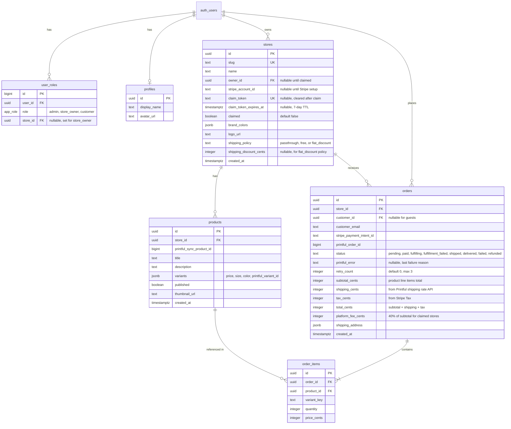
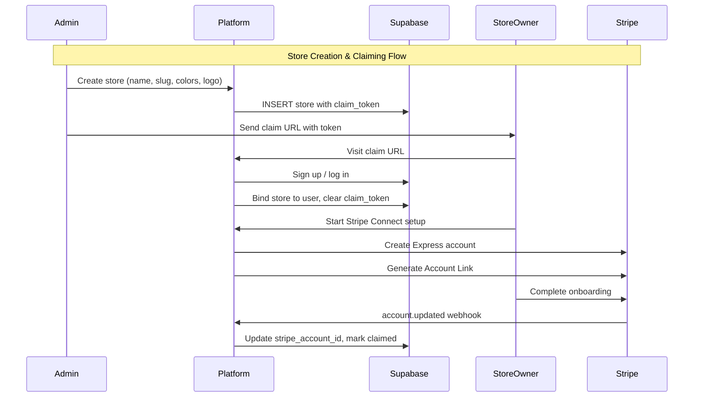
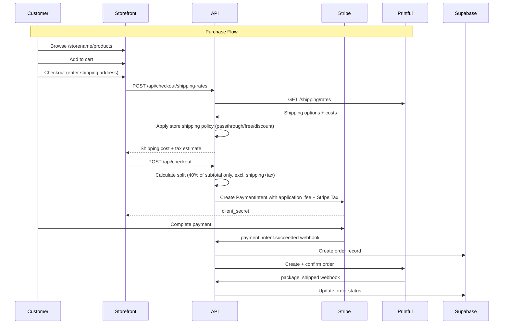

# EZMerch Multi-Tenant POD Storefront Platform MVP

## Overview

Build a multi-tenant print-on-demand e-commerce platform where store owners get branded storefronts at `ezmerch.store/<storename>/`. Admins create stores and products with custom logos; store owners claim their stores and connect Stripe to receive payouts. Revenue splits are configurable: platform keeps 100% on unclaimed stores, then 40% platform / 60% store owner after the owner completes Stripe Connect onboarding. Shipping costs are passed through to customers at cost via Printful's shipping rate API, with store owners optionally able to cover or discount shipping. Sales tax is handled via Stripe Tax.

## Problem Frame

Creators and brands want to sell custom merch without managing inventory, fulfillment, or payment infrastructure. EZMerch solves this by providing a turnkey storefront with print-on-demand fulfillment via Printful, payments via Stripe Connect, and per-store branding — all managed from a central admin interface.

## Requirements Trace

- R1. Admin can create stores, set branding (colors, logo), and assign a URL slug
- R2. Admin can create POD products in any store using the store's logo/branding
- R3. Store owners can claim a pre-created store via a unique invite link
- R4. Store owners complete Stripe Connect Express onboarding to receive payouts
- R5. Store owners can add/manage their own POD products after claiming
- R6. Each storefront is publicly accessible at `ezmerch.store/<storename>/`
- R7. Storefronts render with the store's custom brand colors
- R8. Customers can browse products, add to cart, and checkout (guest or optional account)
- R9. Checkout creates a Stripe payment with the correct revenue split
- R10. Successful payments trigger Printful order creation and fulfillment
- R11. Revenue split: 100% platform for unclaimed stores; 40/60 (platform/owner) for claimed stores with completed Stripe setup
- R12. Webhooks from Stripe and Printful update order/fulfillment status
- R13. Admin dashboard shows all stores, products, orders, and revenue
- R14. Store owner dashboard shows their store's products, orders, and earnings
- R15. Shipping costs are passed through to customers at cost via Printful shipping rate API; store owners can optionally cover or discount shipping for their store
- R16. Sales tax is calculated and collected automatically via Stripe Tax
- R17. Store slugs are validated against a reserved deny-list (login, signup, dashboard, api, claim, auth, admin, etc.) to prevent routing conflicts
- R18. Both admins and store owners can issue refunds; disputes are surfaced to both parties; all stores share a standard return/exchange policy (POD items cannot be returned or exchanged, refunds only for defective/damaged items)

## Scope Boundaries

- **In scope:** Core storefront, admin/owner dashboards, Stripe Connect, Printful integration, multi-tenant routing, per-store theming, shipping cost pass-through with owner discount option, sales tax via Stripe Tax, reserved slug validation
- **Out of scope (v1):** Custom domains per store, email marketing, analytics dashboards, discount codes, inventory beyond POD, mobile app, internationalization, multiple currencies

## Context & Research

### Technology Stack

- **Framework:** Next.js 15 (App Router) with TypeScript
- **Database & Auth:** Supabase (Postgres + Auth + RLS)
- **Payments:** Stripe Connect (Express accounts) with destination charges + Stripe Tax for automatic tax calculation
- **Fulfillment:** Printful API (single platform account)
- **UI:** Tailwind CSS + shadcn/ui with CSS variable theming
- **Deployment:** Vercel

### Relevant Patterns

- **Multi-tenant routing:** Next.js dynamic `[storeSlug]` segment with route groups separating platform `(platform)` and storefront routes
- **Supabase Auth:** `@supabase/ssr` package with three client factories (browser, server, middleware) using cookie-based sessions
- **RLS:** Row Level Security with `auth.uid()` as identity anchor; subselect pattern for tenant isolation
- **Stripe Connect:** Express accounts with Account Links for hosted onboarding; destination charges with `application_fee_amount` for revenue splitting
- **Printful:** Single platform account; sync products with variant IDs; orders created as drafts then confirmed; webhook events for fulfillment status
- **Dynamic theming:** CSS custom properties (`--brand`, `--brand-foreground`) set at runtime per store; registered with Tailwind `@theme inline`
- **Next.js 15 specifics:** `params` is a Promise (must await); Server Components by default; Server Actions with `"use server"`

### External References

- [Stripe Connect Express Accounts](https://docs.stripe.com/connect/express-accounts)
- [Stripe Destination Charges](https://docs.stripe.com/connect/destination-charges)
- [Supabase RLS](https://supabase.com/docs/guides/database/postgres/row-level-security)
- [Supabase Auth with Next.js](https://supabase.com/docs/guides/auth/server-side/nextjs)
- [Printful API](https://developers.printful.com/docs/)
- [Stripe Tax](https://docs.stripe.com/tax)
- [shadcn/ui Theming](https://ui.shadcn.com/docs/theming)
- [Next.js Dynamic Routes](https://nextjs.org/docs/app/building-your-application/routing/dynamic-routes)

## Key Technical Decisions

- **Path-based routing over subdomains:** `ezmerch.store/<storename>/` avoids DNS/wildcard complexity, works on Vercel without extra config, simplifies local dev
- **Stripe Express accounts:** Platform controls onboarding, payout schedule, and charge types; Stripe handles identity verification and compliance
- **Destination charges with application fees:** Simplest marketplace payment pattern; platform is merchant of record; single charge per order
- **Single Printful platform account:** Admin controls product quality and catalog; simpler than per-store OAuth; store owners add products through the platform UI which creates Printful sync products under the platform account
- **Supabase Auth with custom claims:** User roles (admin, store_owner, customer) stored in `user_roles` table and injected into JWT via custom access token hook for efficient RLS evaluation
- **CSS variable theming:** Per-store brand colors applied via `--brand` custom property at runtime; avoids generating per-store CSS bundles
- **Guest checkout with optional accounts:** Lowest friction for conversion; accounts enable order history
- **Shipping pass-through with owner control:** Shipping costs fetched from Printful's shipping rate API and passed through to customers by default; store owners can choose to cover shipping (free shipping) or offer discounted shipping; shipping is excluded from the 40/60 revenue split since it's a cost pass-through
- **Stripe Tax for sales tax:** Platform is merchant of record via destination charges, so sales tax obligations apply; Stripe Tax auto-calculates tax per jurisdiction with minimal additional integration since Stripe is already in use
- **Reserved slug deny-list:** Store slugs validated against a deny-list of platform routes (login, signup, dashboard, api, claim, auth, admin, etc.) during creation to prevent routing conflicts with the `[storeSlug]` dynamic segment

## Open Questions

### Resolved During Planning

- **Revenue split for unclaimed stores:** Platform keeps 100% — no held funds needed. Simplifies implementation significantly.
- **Printful account model:** Single platform account. Store owners add products through the EZMerch UI, not directly via Printful.
- **Customer auth model:** Guest checkout with optional account creation. Email + shipping address is sufficient for guest orders.
- **Store claiming mechanism:** Admin generates a unique claim token stored on the store record. Claim URL includes the token. User signs up/logs in and the token binds the store to their account.

### Deferred to Implementation

- **Printful product template system:** Exact UX for how admins/owners select base products, upload logos, and configure variants — depends on Printful catalog API response shape
- **Optimistic UI patterns:** Cart and checkout interaction details will be refined during implementation
- **Email notifications:** Transactional email provider selection and template design deferred to a later unit

## High-Level Technical Design

> *This illustrates the intended approach and is directional guidance for review, not implementation specification. The implementing agent should treat it as context, not code to reproduce.*

### Data Model (ERD)



### Core Flows





### App Router Structure

```
app/
  layout.tsx                          # Root layout (fonts, metadata)
  globals.css                         # Base theme + brand CSS vars
  (platform)/                         # Route group: platform pages
    layout.tsx                        # Platform nav/footer
    page.tsx                          # Homepage / store directory
    login/page.tsx
    signup/page.tsx
    claim/[token]/page.tsx            # Store claiming flow
    dashboard/                        # Authenticated area
      layout.tsx                      # Dashboard sidebar layout
      page.tsx                        # Dashboard home
      admin/                          # Admin-only routes
        stores/page.tsx               # Manage all stores
        stores/new/page.tsx           # Create store
        stores/[storeId]/page.tsx     # Edit store
        stores/[storeId]/products/page.tsx
        orders/page.tsx               # All orders
      store/                          # Store owner routes
        page.tsx                      # My store overview
        products/page.tsx             # My products
        products/new/page.tsx         # Add product
        orders/page.tsx               # My orders
        settings/page.tsx             # Store settings
        connect/page.tsx              # Stripe Connect onboarding
  [storeSlug]/                        # Dynamic storefront
    layout.tsx                        # Store-branded layout
    page.tsx                          # Store homepage
    products/page.tsx                 # Product listing
    products/[productId]/page.tsx     # Product detail
    cart/page.tsx                     # Shopping cart
    checkout/page.tsx                 # Checkout
    order-confirmation/page.tsx       # Post-purchase
  api/
    checkout/
      route.ts                       # Create PaymentIntent
      shipping-rates/route.ts        # Fetch Printful shipping rates + apply store policy
    webhooks/
      stripe/route.ts                # Stripe webhooks
      printful/route.ts              # Printful webhooks
    stripe/
      connect/onboard/route.ts       # Create Express account + link
    printful/
      products/route.ts              # Create/sync products
```

## Implementation Units

### Priority Order

| Priority | Units | Milestone |
|----------|-------|-----------|
| P0 — Core | 1, 2, 3, 4, 5 | Auth, admin, claiming, Stripe Connect |
| P1 — Product & Storefront | 6, 7, 8 | Printful integration, product management, public storefront |
| P2 — Purchase Flow | 9 | Checkout, payments, fulfillment |
| P3 — Dashboards & Polish | 10, 11, 12 | Owner dashboard, admin dashboard, homepage |

- [ ] **Unit 1: Project Scaffolding & Supabase Setup** `P0`

  **Goal:** Initialize the Next.js 15 project with TypeScript, Tailwind, shadcn/ui, and configure Supabase with the core database schema and RLS policies.

  **Requirements:** Foundation for all other units

  **Dependencies:** None

  **Files:**
  - Create: `package.json`, `tsconfig.json`, `next.config.ts`, `tailwind.config.ts`
  - Create: `app/layout.tsx`, `app/globals.css`
  - Create: `lib/supabase/client.ts` (browser client)
  - Create: `lib/supabase/server.ts` (server client)
  - Create: `lib/supabase/middleware.ts` (middleware client helper)
  - Create: `middleware.ts`
  - Create: `supabase/migrations/001_initial_schema.sql`
  - Create: `components.json` (shadcn/ui config)
  - Test: Manual verification — `npm run dev` serves the app; Supabase tables exist with RLS enabled

  **Approach:**
  - `npx create-next-app@latest` with App Router, TypeScript, Tailwind, src disabled
  - `npx shadcn@latest init` with `new-york` style, CSS variables, `rsc: true`
  - Supabase migration creates: `stores`, `products`, `orders`, `order_items`, `profiles`, `user_roles` tables, `app_role` enum, RLS policies, indexes on foreign keys
  - Three Supabase client factories following `@supabase/ssr` patterns
  - Middleware refreshes Supabase auth session on every request
  - Environment variables: `NEXT_PUBLIC_SUPABASE_URL`, `NEXT_PUBLIC_SUPABASE_ANON_KEY`, `SUPABASE_SERVICE_ROLE_KEY`

  **Patterns to follow:**
  - Supabase SSR cookie-based auth pattern with `getAll`/`setAll`
  - RLS policies using `auth.uid()` with subselect for tenant isolation

  **Test scenarios:**
  - Tables created with correct columns and constraints
  - RLS policies prevent unauthenticated writes
  - Public read policies allow product/store browsing without auth
  - Supabase client connects from both server and browser contexts

  **Verification:**
  - App starts on `localhost:3000`
  - Supabase migration applies cleanly
  - All tables have RLS enabled

---

- [ ] **Unit 2: Auth System & Role Management** `P0`

  **Goal:** Implement authentication (signup, login, logout) with Supabase Auth and role-based access control (admin, store_owner, customer).

  **Requirements:** R3, R13, R14

  **Dependencies:** Unit 1

  **Files:**
  - Create: `app/(platform)/login/page.tsx`
  - Create: `app/(platform)/signup/page.tsx`
  - Create: `app/(platform)/auth/callback/route.ts`
  - Create: `lib/auth.ts` (auth helpers: getUser, requireAuth, requireAdmin)
  - Create: `supabase/migrations/002_auth_roles.sql` (custom access token hook, role_permissions seed)
  - Modify: `middleware.ts` (add route protection for `/dashboard`)
  - Test: `__tests__/auth.test.ts`

  **Approach:**
  - Supabase Auth with email/password (add OAuth providers later)
  - Custom access token hook injects `user_role` into JWT claims
  - `role_permissions` table seeded with permissions per role
  - `authorize()` Postgres function for RLS policies
  - Middleware redirects unauthenticated users from `/dashboard/*` to `/login`
  - Default role on signup: `customer`

  **Patterns to follow:**
  - Supabase RBAC custom claims pattern
  - `@supabase/ssr` auth callback handling

  **Test scenarios:**
  - User can sign up and receives `customer` role by default
  - Login returns valid session with role in JWT
  - Admin routes reject non-admin users
  - Store owner routes reject users who don't own that store
  - Unauthenticated access to `/dashboard` redirects to `/login`

  **Verification:**
  - Full signup → login → dashboard flow works
  - JWT contains `user_role` claim
  - RLS policies using `authorize()` function work correctly

---

- [ ] **Unit 3: Admin Dashboard & Store Management** `P0`

  **Goal:** Build the admin dashboard where admins can create stores, set branding, generate claim tokens, and manage all stores.

  **Requirements:** R1, R3, R13

  **Dependencies:** Unit 2

  **Files:**
  - Create: `app/(platform)/dashboard/layout.tsx`
  - Create: `app/(platform)/dashboard/page.tsx`
  - Create: `app/(platform)/dashboard/admin/stores/page.tsx`
  - Create: `app/(platform)/dashboard/admin/stores/new/page.tsx`
  - Create: `app/(platform)/dashboard/admin/stores/[storeId]/page.tsx`
  - Create: `app/actions/stores.ts` (Server Actions: createStore, updateStore, generateClaimLink)
  - Create: `components/dashboard/store-form.tsx`
  - Create: `components/dashboard/stores-table.tsx`
  - Create: `components/dashboard/sidebar.tsx`
  - Create: `lib/claim-token.ts` (token generation utility)
  - Create: `lib/reserved-slugs.ts` (deny-list of reserved slugs)
  - Test: `__tests__/stores.test.ts`

  **Approach:**
  - Server Actions for store CRUD with admin authorization checks
  - **Reserved slug validation:** Store slug validated against a deny-list of platform routes (`login`, `signup`, `dashboard`, `api`, `claim`, `auth`, `admin`, `settings`, `checkout`, `cart`, etc.) before creation; reject with clear error message
  - Claim token: 256-bit (32-byte) cryptographically random string (base64url-encoded) stored on store record with a `claim_token_expires_at` timestamp (default 7-day TTL); expired tokens are rejected on claim attempt
  - Claim URL format: `ezmerch.store/claim/<token>`
  - Store form includes: name, slug (auto-generated from name, editable), brand primary color, brand accent color, logo upload (Supabase Storage), shipping policy (passthrough/free/flat discount)
  - shadcn/ui `DataTable` for store listing with status indicators (unclaimed/claimed)
  - Dashboard sidebar navigation using shadcn/ui `Sidebar` component

  **Patterns to follow:**
  - shadcn/ui form patterns with `react-hook-form` + `zod` validation
  - Server Actions with `revalidatePath` after mutations

  **Test scenarios:**
  - Admin can create a store with slug, name, and brand colors
  - Slug uniqueness is enforced
  - Reserved slugs (login, dashboard, api, etc.) are rejected with clear error
  - Claim token is generated and stored
  - Non-admin users cannot access admin routes
  - Store list shows claimed/unclaimed status

  **Verification:**
  - Admin can create a store and see it in the list
  - Claim URL is generated and copyable
  - Store branding (colors, logo) persists correctly

---

- [ ] **Unit 4: Store Claiming Flow** `P0`

  **Goal:** Implement the flow where a store owner visits a claim link, signs up or logs in, and the store is bound to their account.

  **Requirements:** R3

  **Dependencies:** Unit 2, Unit 3

  **Files:**
  - Create: `app/(platform)/claim/[token]/page.tsx`
  - Create: `app/actions/claim.ts` (Server Action: claimStore)
  - Create: `components/claim/claim-store-card.tsx`
  - Modify: `supabase/migrations/001_initial_schema.sql` or new migration for claim-related indexes
  - Test: `__tests__/claim.test.ts`

  **Approach:**
  - Claim page looks up store by token; shows store name and branding preview
  - If user is not authenticated, show signup/login options (redirect back after auth)
  - On claim: set `owner_id`, add `store_owner` role to `user_roles`, clear `claim_token`, set `claimed = true`
  - Server Action validates token exists, store is unclaimed, and user doesn't already own a store (or allow multiple — decide in implementation)
  - After successful claim, redirect to store owner dashboard with prompt to set up Stripe

  **Test scenarios:**
  - Valid token shows store preview and claim button
  - Invalid/expired token shows error
  - Already-claimed store token returns error
  - Unauthenticated user is redirected to signup, then back to claim
  - Successful claim binds store to user and clears token
  - User receives `store_owner` role after claiming

  **Verification:**
  - End-to-end: admin creates store → copies claim link → new user visits link → signs up → store is claimed → user lands on owner dashboard

---

- [ ] **Unit 5: Stripe Connect Integration** `P0`

  **Goal:** Implement Stripe Connect Express onboarding for store owners and the revenue splitting logic for checkout.

  **Requirements:** R4, R9, R11

  **Dependencies:** Unit 4

  **Files:**
  - Create: `lib/stripe.ts` (Stripe client, helpers)
  - Create: `app/api/stripe/connect/onboard/route.ts`
  - Create: `app/(platform)/dashboard/store/connect/page.tsx`
  - Create: `app/api/webhooks/stripe/route.ts`
  - Create: `lib/revenue.ts` (split calculation: `calculateApplicationFee(store, totalCents)`)
  - Test: `__tests__/stripe-connect.test.ts`

  **Approach:**
  - Store owner clicks "Connect Stripe" → API creates Express account → generates Account Link → redirects to Stripe onboarding
  - Return URL checks `charges_enabled` and `payouts_enabled` on the account
  - Webhook listens for `account.updated` to confirm onboarding completion; updates `stripe_account_id` on store
  - Revenue split logic in `lib/revenue.ts`:
    - Split applies to **product subtotal only** — shipping and tax are excluded from the split calculation
    - **Split condition:** store must have BOTH `claimed === true` AND a valid `stripe_account_id` to receive payouts
    - If either condition is false: platform keeps 100% (no `transfer_data` on PaymentIntent)
    - If both conditions are true: `application_fee_amount` = 40% of subtotal, `transfer_data.destination` = store's Stripe account
    - Shipping cost: determined by store's `shipping_policy` (passthrough at Printful cost, free, or flat discount)
    - Tax: calculated by Stripe Tax and added to PaymentIntent via `automatic_tax: { enabled: true }`
  - Stripe webhook signature verification using `stripe.webhooks.constructEvent`
  - **Refund handling:** Both admins and store owners can issue refunds via `stripe.refunds.create`. For destination charges, use `refund_application_fee: true` to also refund the platform's cut. Refund sets order status to `refunded`. Webhook `charge.refunded` updates order record.
  - **Dispute handling:** Webhook `charge.dispute.created` alerts both admin and store owner (via dashboard notification). Standard POD return policy displayed on all storefronts: "Print-on-demand items cannot be returned or exchanged. Refunds are issued only for defective or damaged items."

  **Patterns to follow:**
  - Stripe Account Links with refresh/return URL pattern
  - Destination charges with `application_fee_amount`

  **Test scenarios:**
  - Onboarding creates Express account and returns valid Account Link URL
  - Return URL correctly checks account status
  - Unclaimed store: PaymentIntent has no `transfer_data`, full amount to platform
  - Claimed store with Stripe: PaymentIntent has 40% `application_fee_amount` and correct `destination`
  - Webhook updates store record when onboarding completes
  - Webhook signature verification rejects tampered payloads
  - Refund reverses both platform fee and store owner payout
  - Dispute webhook notifies both admin and store owner

  **Verification:**
  - Store owner can complete Stripe Connect onboarding (test mode)
  - Revenue calculation returns correct amounts for both store states
  - Webhook endpoint responds 200 to valid events

---

- [ ] **Unit 6: Printful Integration** `P1`

  **Goal:** Integrate the Printful API for product creation (sync products) and order fulfillment.

  **Requirements:** R2, R5, R10, R12

  **Dependencies:** Unit 1

  **Files:**
  - Create: `lib/printful.ts` (API client, typed helpers)
  - Create: `app/api/printful/products/route.ts` (create sync product)
  - Create: `app/api/printful/catalog/route.ts` (browse Printful catalog)
  - Create: `app/api/webhooks/printful/route.ts`
  - Create: `lib/printful-types.ts` (TypeScript types for Printful API responses)
  - Test: `__tests__/printful.test.ts`

  **Approach:**
  - Single platform Printful account with Private Token auth
  - `printfulFetch` helper with auth header, error handling, and rate limit awareness (120 req/min)
  - Product creation flow: select base product from catalog → upload design file → create sync product with variants and retail prices
  - Order creation: draft order → confirm → track via webhooks
  - Webhook events: `package_shipped` (update order status + tracking), `order_failed` (alert + potential refund)
  - **Printful webhook signature verification** using `PRINTFUL_WEBHOOK_SECRET` — compare `X-Printful-Webhook-Secret` header against stored secret; reject unsigned/tampered payloads
  - Store `printful_sync_product_id` on products table for linking
  - **Access control:** `POST /api/printful/products` requires admin or store_owner role (scoped to their store); `GET /api/printful/catalog` requires authenticated user

  **Patterns to follow:**
  - Printful API v2 patterns where available, v1 fallback
  - `external_id` linking for orders

  **Test scenarios:**
  - Can fetch Printful catalog products and variants
  - Can create sync product with design file and variant pricing
  - Can create and confirm an order
  - Webhook handler correctly parses `package_shipped` event
  - Webhook handler rejects requests with missing or invalid signature
  - Unauthenticated requests to `/api/printful/products` are rejected
  - Store owners cannot create products in stores they don't own via the API
  - Rate limit handling doesn't cause failures

  **Verification:**
  - Products created in Printful appear in Printful dashboard (test/sandbox)
  - Order creation flow completes without errors
  - Webhook endpoint processes events and updates Supabase

---

- [ ] **Unit 7: Product Management UI** `P1`

  **Goal:** Build the product creation and management interface for both admins (any store) and store owners (their store).

  **Requirements:** R2, R5

  **Dependencies:** Unit 3, Unit 6

  **Files:**
  - Create: `app/(platform)/dashboard/admin/stores/[storeId]/products/page.tsx`
  - Create: `app/(platform)/dashboard/admin/stores/[storeId]/products/new/page.tsx`
  - Create: `app/(platform)/dashboard/store/products/page.tsx`
  - Create: `app/(platform)/dashboard/store/products/new/page.tsx`
  - Create: `app/actions/products.ts` (Server Actions: createProduct, updateProduct, deleteProduct)
  - Create: `components/dashboard/product-form.tsx`
  - Create: `components/dashboard/product-catalog-picker.tsx` (Printful catalog browser)
  - Create: `components/dashboard/products-table.tsx`
  - Test: `__tests__/products.test.ts`

  **Approach:**
  - **Single-page product creation form** with visually separated sections: 1) Pick base product from Printful catalog, 2) Upload logo/design, 3) Configure variants (sizes, colors), 4) Set retail prices (with Printful base cost displayed), 5) Publish. No multi-step wizard — all sections visible on one page for simplicity.
  - **Price floor validation:** Retail price for every variant must exceed the Printful base cost for that variant. Fetch base costs from the Printful catalog API and display them alongside the price input. Reject any price at or below cost. Re-validate at checkout time in case Printful costs have changed since product creation.
  - Admin version allows selecting which store to add products to
  - Store owner version is scoped to their store
  - Server Actions handle auth checks (admin can edit any store, owner only their own)
  - Design file upload to Supabase Storage; URL passed to Printful
  - Product thumbnails from Printful mockup generation

  **Patterns to follow:**
  - shadcn/ui form patterns with `react-hook-form` + `zod` validation
  - Supabase Storage for file uploads

  **Test scenarios:**
  - Admin can create a product in any store
  - Store owner can only create products in their own store
  - Retail price below Printful base cost is rejected with clear error showing the minimum
  - Product syncs to Printful with correct variant/design data
  - Product appears in store's product list after creation
  - Published/unpublished toggle works

  **Verification:**
  - Product created through UI exists in both Supabase and Printful
  - Product thumbnails render correctly
  - Authorization prevents cross-store product management

---

- [ ] **Unit 8: Multi-Tenant Storefront** `P1`

  **Goal:** Build the public-facing storefront with dynamic routing, per-store branding, product browsing, and cart functionality.

  **Requirements:** R6, R7, R8

  **Dependencies:** Unit 1, Unit 7

  **Files:**
  - Create: `app/[storeSlug]/layout.tsx` (store-branded layout)
  - Create: `app/[storeSlug]/page.tsx` (store homepage)
  - Create: `app/[storeSlug]/products/page.tsx` (product listing)
  - Create: `app/[storeSlug]/products/[productId]/page.tsx` (product detail)
  - Create: `app/[storeSlug]/cart/page.tsx`
  - Create: `components/storefront/store-header.tsx`
  - Create: `components/storefront/product-card.tsx`
  - Create: `components/storefront/product-gallery.tsx`
  - Create: `components/storefront/cart-provider.tsx` (client-side cart state)
  - Create: `components/storefront/cart-sheet.tsx` (slide-out cart)
  - Create: `components/storefront/tenant-theme-provider.tsx`
  - Modify: `middleware.ts` (tenant slug resolution, set header)
  - Test: `__tests__/storefront.test.ts`

  **Approach:**
  - `[storeSlug]/layout.tsx` fetches store record by slug in a Server Component, applies brand colors via `TenantThemeProvider`
  - Brand theming: `--brand` and `--brand-foreground` CSS variables set dynamically; used in Tailwind via `@theme inline` registration
  - Store homepage shows hero with store logo + name, featured products grid
  - Product detail page: image gallery, variant selector (size/color), add-to-cart
  - Cart: client-side state via React context + localStorage; cart sheet (shadcn `Sheet`) accessible from header
  - 404 page if store slug doesn't exist
  - `generateStaticParams` for high-traffic stores; dynamic rendering for others

  **Patterns to follow:**
  - Next.js 15 `await params` pattern for dynamic segments
  - shadcn/ui `Card`, `Sheet`, `Select` components
  - CSS variable theming with `--brand` namespace

  **Test scenarios:**
  - Valid store slug renders storefront with correct branding
  - Invalid slug shows 404
  - Products display with correct prices and thumbnails
  - Variant selection updates product display
  - Cart persists across page navigation (localStorage)
  - Brand colors apply to buttons, headers, and accents

  **Verification:**
  - Visiting `localhost:3000/<slug>` renders the branded storefront
  - Multiple stores have visually distinct branding
  - Cart operations (add, remove, update quantity) work correctly

---

- [ ] **Unit 9: Checkout & Order Flow** `P2`

  **Goal:** Implement the checkout page with Stripe payment, order creation in Supabase, and Printful fulfillment trigger.

  **Requirements:** R8, R9, R10, R11, R12, R15, R16

  **Dependencies:** Unit 5, Unit 6, Unit 8

  **Files:**
  - Create: `app/[storeSlug]/checkout/page.tsx`
  - Create: `app/[storeSlug]/order-confirmation/page.tsx`
  - Create: `app/api/checkout/route.ts`
  - Create: `app/api/checkout/shipping-rates/route.ts` (fetch Printful shipping rates)
  - Create: `components/checkout/checkout-form.tsx` (Stripe Elements)
  - Create: `components/checkout/shipping-form.tsx`
  - Create: `components/checkout/order-summary.tsx`
  - Create: `lib/orders.ts` (order creation, fulfillment trigger)
  - Create: `lib/shipping.ts` (shipping rate calculation with store policy)
  - Modify: `app/api/webhooks/stripe/route.ts` (handle `payment_intent.succeeded`)
  - Modify: `app/api/webhooks/printful/route.ts` (handle `package_shipped`)
  - Test: `__tests__/checkout.test.ts`

  **Approach:**
  - Checkout page: shipping address form → fetch shipping rates → order summary (subtotal + shipping + tax) → Stripe Payment Element
  - **Shipping rate flow:**
    1. Customer enters shipping address
    2. `POST /api/checkout/shipping-rates` calls Printful's `POST /shipping/rates` with cart items and destination
    3. Apply store's `shipping_policy`: passthrough (full Printful cost), free (store covers), or flat discount (reduce by `shipping_discount_cents`)
    4. Display final shipping cost to customer in order summary
  - **Tax:** Enable Stripe Tax on PaymentIntent with `automatic_tax: { enabled: true }` — Stripe calculates jurisdiction-specific sales tax automatically
  - **Revenue split:** `POST /api/checkout` creates PaymentIntent using `lib/revenue.ts`:
    - Split calculated on **product subtotal only** (excludes shipping and tax)
    - Unclaimed store: no `transfer_data`, platform collects 100%
    - Claimed store: `application_fee_amount` = 40% of subtotal, `transfer_data.destination` = store's Stripe account
  - **Server-side cart validation:** Checkout endpoint validates all cart items against the database — confirms products exist, belong to the store, variants are valid, and uses server-side prices (never trusts client-submitted prices)
  - **Rate limiting:** `POST /api/checkout` and `POST /api/checkout/shipping-rates` are rate-limited per IP (e.g., via Vercel Edge Middleware or `@upstash/ratelimit`) to prevent card testing abuse on this unauthenticated endpoint
  - Guest checkout: collect email + shipping; optional "create account" checkbox
  - On `payment_intent.succeeded` webhook:
    1. Create order + order_items in Supabase
    2. Create Printful order with items mapped to `sync_variant_id`
    3. Confirm Printful order to trigger fulfillment
  - **Printful failure recovery:** If Printful order creation or confirmation fails after payment:
    1. Set order status to `fulfillment_failed` and store the error in a `printful_error` column on orders
    2. Auto-retry up to 3 times with exponential backoff (e.g., 1min, 5min, 30min) via Vercel Cron or delayed invocation
    3. After 3 failures, alert admin via dashboard notification for manual investigation and retry
    4. Admin can trigger manual retry from the orders dashboard
  - On `package_shipped` webhook: update order status, store tracking info
  - Order confirmation page shows order details and tracking (when available)

  **Patterns to follow:**
  - Stripe Elements `PaymentElement` with `clientSecret`
  - Printful order creation with `external_id`
  - Server-side webhook processing with signature verification

  **Test scenarios:**
  - Checkout creates correct PaymentIntent for unclaimed store (100% platform)
  - Checkout creates correct PaymentIntent for claimed store (40/60 split on subtotal only)
  - Shipping rates fetched from Printful and displayed correctly
  - Store with free shipping policy shows $0 shipping
  - Store with flat discount policy reduces shipping cost correctly
  - Tax is calculated via Stripe Tax and included in total
  - Server-side cart validation rejects manipulated prices or invalid products
  - Successful payment triggers Printful order creation
  - Order record created in Supabase with correct subtotal, shipping, tax, and platform fee
  - Guest checkout works without authentication
  - Shipping webhook updates order with tracking info
  - Failed payment does not create order or Printful fulfillment

  **Verification:**
  - End-to-end: add to cart → checkout → pay (Stripe test card) → order appears in Supabase → Printful order created
  - Revenue split amounts are correct in Stripe dashboard (test mode)
  - Order confirmation page displays order details

---

- [ ] **Unit 10: Store Owner Dashboard** `P3`

  **Goal:** Build the store owner's dashboard showing their store's products, orders, earnings, and settings.

  **Requirements:** R5, R14, R18

  **Dependencies:** Unit 4, Unit 7, Unit 9

  **Files:**
  - Create: `app/(platform)/dashboard/store/page.tsx` (overview with stats)
  - Create: `app/(platform)/dashboard/store/orders/page.tsx`
  - Create: `app/(platform)/dashboard/store/settings/page.tsx`
  - Create: `components/dashboard/order-table.tsx`
  - Create: `components/dashboard/earnings-summary.tsx`
  - Create: `components/dashboard/store-settings-form.tsx`
  - Create: `components/dashboard/refund-dialog.tsx`
  - Create: `app/actions/store-settings.ts`
  - Create: `app/actions/refunds.ts` (Server Action: issueRefund)
  - Test: `__tests__/store-dashboard.test.ts`

  **Approach:**
  - Overview: total orders, revenue earned (owner's share), pending orders, recent orders
  - Orders list: filterable by status, shows customer email, items, amount, fulfillment status
  - **Refund action:** Store owner can issue refund on individual orders via refund dialog; triggers Stripe refund with `refund_application_fee: true`; updates order status to `refunded`
  - **Dispute alerts:** Dashboard shows banner/notification when a dispute is filed on one of their orders
  - Settings: update store name, brand colors, logo, shipping policy (passthrough/free/flat discount); changes take effect on storefront immediately via `revalidatePath`
  - Earnings calculated from `orders` table: sum of `(subtotal_cents - platform_fee_cents)` for their store (excludes shipping and tax pass-throughs)
  - Stripe Connect status indicator (connected/not connected) with link to onboarding

  **Patterns to follow:**
  - shadcn/ui `DataTable` with filtering and sorting
  - Server Components for data fetching, Client Components for interactive filters

  **Test scenarios:**
  - Store owner sees only their store's orders
  - Earnings calculation matches expected 60% of order totals
  - Settings changes reflect on the public storefront
  - Non-owners cannot access another store's dashboard

  **Verification:**
  - Owner dashboard shows accurate order and earnings data
  - Store settings changes apply immediately to the storefront

---

- [ ] **Unit 11: Admin Orders & Revenue Dashboard** `P3`

  **Goal:** Build the admin view for managing all orders across all stores and monitoring platform revenue.

  **Requirements:** R13

  **Dependencies:** Unit 9

  **Files:**
  - Create: `app/(platform)/dashboard/admin/orders/page.tsx`
  - Create: `app/(platform)/dashboard/admin/page.tsx` (admin overview with platform stats)
  - Create: `components/dashboard/admin-stats.tsx`
  - Create: `components/dashboard/admin-orders-table.tsx`
  - Test: `__tests__/admin-dashboard.test.ts`

  **Approach:**
  - Admin overview: total revenue, platform fees collected, number of stores (claimed/unclaimed), total orders
  - Orders table: all orders across all stores, filterable by store, status, date
  - Order detail: links to store, shows payment split breakdown
  - **Refund action:** Admin can issue refund on any order; same refund dialog and Server Action as store owner
  - **Dispute management:** Admin sees all disputes across stores; can respond to disputes
  - **Fulfillment retry:** Admin can trigger manual Printful retry for `fulfillment_failed` orders
  - Uses Supabase service role or admin RLS policies for cross-store access

  **Test scenarios:**
  - Admin sees orders from all stores
  - Revenue stats aggregate correctly across stores
  - Non-admin users cannot access admin dashboard
  - Filter by store works correctly
  - Admin can issue refund on any order
  - Admin can retry failed fulfillment orders

  **Verification:**
  - Admin dashboard shows accurate platform-wide metrics
  - All store orders are visible and filterable

---

- [ ] **Unit 12: Platform Homepage & Store Directory** `P3`

  **Goal:** Build the public homepage that showcases available stores and serves as the platform landing page.

  **Requirements:** R6

  **Dependencies:** Unit 8

  **Files:**
  - Create: `app/(platform)/page.tsx`
  - Create: `app/(platform)/layout.tsx`
  - Create: `components/platform/store-directory.tsx`
  - Create: `components/platform/hero.tsx`
  - Create: `components/platform/navbar.tsx`
  - Create: `components/platform/footer.tsx`

  **Approach:**
  - Hero section explaining the platform value proposition
  - Store directory grid showing published stores with their logos and brand colors
  - Each store card links to `/<slug>/`
  - Platform navbar with login/signup links
  - Responsive layout with Tailwind

  **Test scenarios:**
  - Homepage loads and displays store directory
  - Only stores with published products appear
  - Store cards link to correct storefront URLs
  - Responsive layout works on mobile

  **Verification:**
  - Homepage renders with store cards
  - Navigation to individual storefronts works

## System-Wide Impact

- **Interaction graph:** Stripe webhooks → order creation → Printful fulfillment → Printful webhooks → order status updates. Failure at any point must not leave inconsistent state.
- **Error propagation:** Webhook handlers should be idempotent. Failed Printful orders should update order status to `failed` and alert admin. Stripe webhook retries should not create duplicate orders (use `stripe_payment_intent_id` as idempotency key).
- **State lifecycle risks:** Partial order creation (Supabase succeeds, Printful fails) handled via auto-retry (3 attempts with backoff) then manual admin intervention. Store claiming must be atomic (bind owner + clear token + add role in one transaction).
- **Refund propagation:** Refunds on destination charges must reverse both the platform fee and store owner payout via `refund_application_fee: true`. Disputes surfaced to both admin and store owner dashboards.
- **API surface parity:** Admin and store owner product creation use the same underlying Server Actions with different authorization checks.
- **Integration coverage:** End-to-end tests should cover: signup → claim → Stripe Connect → product creation → customer purchase → fulfillment webhook cycle.

## Risks & Dependencies

- **Printful API rate limits (120 req/min):** Bulk product operations need queuing. Not a concern for v1 scale but should be accounted for in the API client.
- **Stripe Connect onboarding drop-off:** Users may abandon mid-onboarding. The refresh URL must correctly resume onboarding. Store should function (admin-managed) even if owner never completes Stripe.
- **Webhook reliability:** Both Stripe and Printful retry failed webhooks. Handlers must be idempotent to avoid duplicate orders/fulfillments.
- **Supabase RLS performance:** Complex RLS policies with subselects can slow down queries at scale. Indexes on `store_id`, `owner_id`, and `customer_id` are critical.
- **Printful sandbox availability:** Printful's test environment has limitations. Some integration testing may require careful mocking.

## Documentation / Operational Notes

- **Environment variables:** Document all required env vars in `.env.example`
- **Stripe test mode:** All development uses Stripe test keys and test cards
- **Printful sandbox:** Use Printful sandbox environment for development; real products created in test won't incur charges
- **Supabase local dev:** Use `supabase start` for local development with `supabase/migrations/` for schema management
- **Vercel deployment:** Configure environment variables in Vercel dashboard; set up webhook URLs to point to production domain after deployment

## Sources & References

- Related code: `ezmerch/` (greenfield project, initial commit only)
- [Stripe Connect Express Accounts](https://docs.stripe.com/connect/express-accounts)
- [Stripe Destination Charges](https://docs.stripe.com/connect/destination-charges)
- [Stripe Hosted Onboarding](https://docs.stripe.com/connect/hosted-onboarding)
- [Stripe Tax](https://docs.stripe.com/tax)
- [Supabase RLS](https://supabase.com/docs/guides/database/postgres/row-level-security)
- [Supabase Auth SSR](https://supabase.com/docs/guides/auth/server-side/nextjs)
- [Supabase RBAC Custom Claims](https://supabase.com/docs/guides/database/postgres/custom-claims-and-role-based-access-control-rbac)
- [Printful API Docs](https://developers.printful.com/docs/)
- [Next.js App Router Dynamic Routes](https://nextjs.org/docs/app/building-your-application/routing/dynamic-routes)
- [shadcn/ui Theming](https://ui.shadcn.com/docs/theming)
